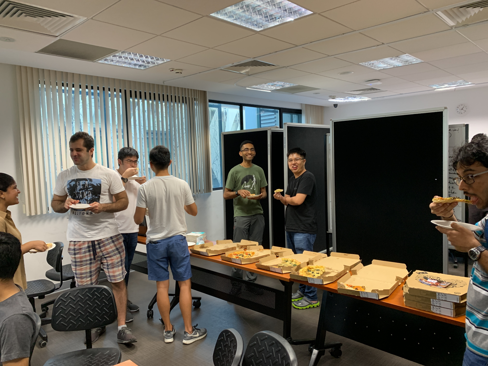

**Do note that the recording for this session is split up into 3 parts, of which only the first is linked here. The rest can be found at our youtube channel, located [here](https://www.youtube.com/channel/UCUbobZWvBIYmCOsc_33vwGQ).**

The capability of Rendezvous and docking (RvD) of space systems was a key building block for astronauts to reach the moon. It was also the central theme for nations to build the International Space Station as lego blocks coming together.

lnfinite Orbits (IO), a Singapore based company, is building the same from scratch and also making it autonomous by putting more intelligence in the system.

This core IP of RvD, developed in-house uses the latest AI techniques for its navigation system. This competency allows many new markets to open such as life extension of GEO satellites, active Debris Removal for LEO constellations, lower cost, reusable and self assembling satellites, and other exciting future opportunities.

## Speaker Bio

Akshay Gulati has over a decade of experience in developing space systems. At Infinite Orbits, his work involves building satellites for multiple use cases such as life extension of telecom satellites and bringing into use of orbital slots. Along with a team of experts, he has also worked on an IAA (International Academy of Astronautics) study group to develop ISO standards for a new class of low-cost & fast delivery satellites. Finally, he was the chief engineer of IITMSAT, an exploratory mission in the field of understanding space based seismic precursors and a contributor to the mechanical design of Astrosat, India's first dedicated multi-wavelength space observatory.

