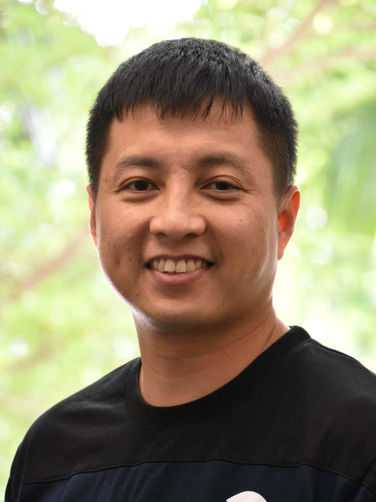

SpeQtral is a spin-off company that is developing space-based quantum communications built on research performed at the Centre for Quantum Technologies (CQT) at the National University of Singapore. In this talk, Chune Yang will be highlighting some of the research activities on space-based quantum communications in Singapore and the technological challenges of putting quantum systems in space. In the context of commercialisation of quantum technologies, he will also be discussing the process and challenges of transitioning from research to industry, highlighting the different perspectives of stakeholders in the ecosystem - academia, technology providers, end users and investors.

## Speaker Bio

Chune Yang Lum is co-founder and CEO at SpeQtral, a spin-off company from the Centre for Quantum Technologies (CQT) that is developing and commercializing space-based quantum communication systems. He was previously Head of Strategic Development at CQT, with a concurrent appointment as Deputy Director, Industry Engagement and Partnerships at NUS, where he was responsible for activities and engagements with industry and government stakeholders in the commercialization of quantum technologies.

Prior to joining CQT, Chune Yang was responsible for business development in Asia-Pacific for SES, a global satellite operator. In this role, he led engagements in satellite programmes with private companies and governments in various countries. He also led market entry strategies and implementation plans for several markets and was involved in various internal innovation initiatives. Before his stint at SES, he was a management consultant with ZS Associates, where he advised MNCs in the US and China markets.

Chune Yang holds an MBA from INSEAD, an MSc. in Physics from the Pennsylvania State University, and a BSc. (Hons) in Physics from the National University of Singapore.

## Company Profile

SpeQtral is developing space-based quantum communication built on technologies developed at the Centre for Quantum Technologies (CQT) at the National University of Singapore. The team has developed technologies that harness the unique properties of quantum physics to enable encryption methods that can secure communications with forward security. SpeQtral is the only team with heritage from a successful on-orbit demonstration of a quantum light source on a cubesat, and is committed to bringing future-proof security to the commercial world. Learn more at <https://www.speqtral.space>.
